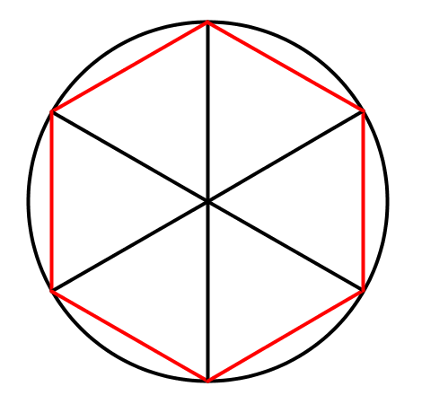
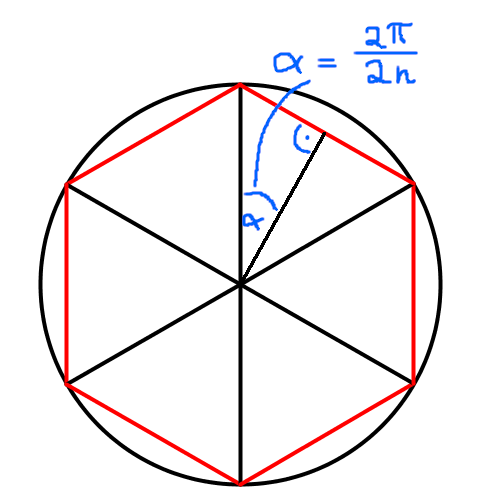
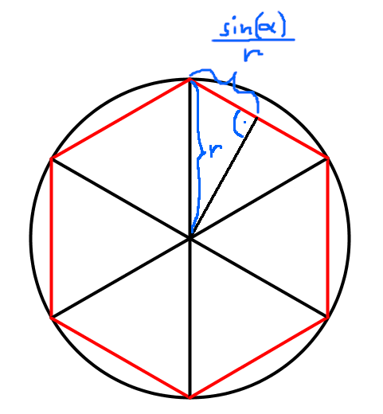
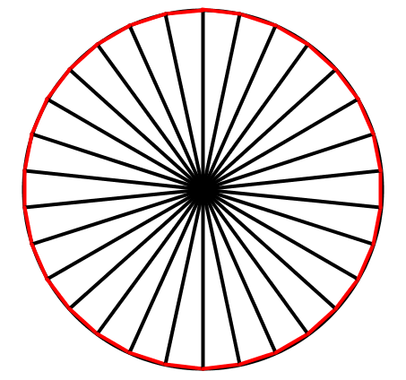
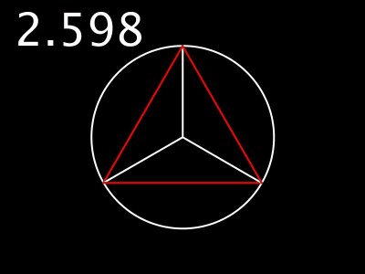

# PI berechnen

In dieser Aufgabe geht es darum, den Wert von PI mit hilfe von Trigonometrie zu berechnen.
Außerdem wird die Logik dahinter visuell dargestellt.

## Ansatz

In dieser Aufgabe geht es darum, anhand eines Programms den Wert
von PI zu berechnen. Dazu wird die Formel für den Kreisumfang:

Umfang = 2*PI*r

herangezogen. Formt man die Formel um, so erhält man:

PI = Umfang / (2*r)

Nun genügt es den Umfang eines Kreises mit bekanntem Radius zu
berechnen und man kann auch PI berechnen. Doch wie können wir den
Kreisumfang berechnen? Normalerweise brauchen wir für dessen Berechnung
den Wert von PI, doch da er uns hier nicht zur Verfügung steht,
werden wir einen Algorithmus dafür programmieren.

## Kreisumfang berechnen

Zur Berechnung des Umfangs machen wir folgenden Gedankengang
Ein Kreis lässt sich annäherungsweise in Dreiecke einteilen. Das
wird in dieser Zeichnung veranschaulicht.

Hier ist auch schon rot gekennzeichnet, welche Linien zusammen den Kreisumfang ergeben.
Zur Berechnung der Länge der roten Linien gehen wir wie folgt vor:

Als erstes teilen wir jedes der Dreiecke wie dargestellt, in der Mitte, um einen rechten
Winkel zu erhalten. Den Winkel **α** können wir leicht mit der angeschriebenen Formel berechnen.
Dabei ist **2π** der volle Winkel, also 360°, welchen wir durch **2n** teilen. **n** ist die Anzahl
der ungeteilten Dreiecke, hier also 6. Somit ergibt sich: α = π / 6

Nun brauchen wir noch einen zweiten Wert aus dem rechtwinkligen Dreieck. Wir entscheiden uns für
die Hypotenuse, deren Wert gleich dem Kreisradius ist. Diesen setzen wir der Einfachheit halber auf 1. 
Nun können wir mit etwas Trigonometrie die Gegenkathete des Dreiecks, welche einen Anteil der roten Linie ergibt, ausrechnen. Dazu wenden wir die Formel zur Berechnung von Sinus an: 

sin(α) = Gegenkathete / Hypotenuse

Umgeformt also:

Gegenkathete = sin(α) * Hypotenuse 

Dazu folgende Skizze:

Die Gegenkathete multiplizieren wir mit 2n und erhalten so den annäherungsweisen Kreisumfang. 
Diesen nennen wir hier **Umfang'**

Umfang' = sin(α) * Hypotenuse * 2n
        = sin(π/6) * r * 12
        = 0.5 * 1 * 12
        = 6
        
Zur Prüfung des Ergebnisses können wir den Kreisumfang mithilfe der Formel ausrechnen.

Umfang = 2\*π\*r = 6.283

Die beiden Werte sind sich, wie hier zu sehen ist, ähnlich aber nicht identisch. Um sich dem
tatsächlichen Wert anzunähern, genügt es einfach **n** zu erhöhen. Für n = 30 z.B. ergibt sich:
 
Umfang' = 6.27171

Auch in der Skizze ist zu sehen, dass dieser Wert sehr nah an den tatsächlichen Umfang gelangt:

Um PI zu berechen ziehen wir nun die bereits oben genannte Formel heran:

PI = Umfang / (2*r)
   = 6.27171 / 2
   = 3.135855
   ≈ 3.14159

Schreibe nun ein Processing Programm, welches den Kreis, die Dreiecke und der
sich ergebende Wert für PI wie in folgendem GIF darstellt. **n** kann während
der Laufzeit, z.B. durch Bewegung der Maus angepasst werden.

