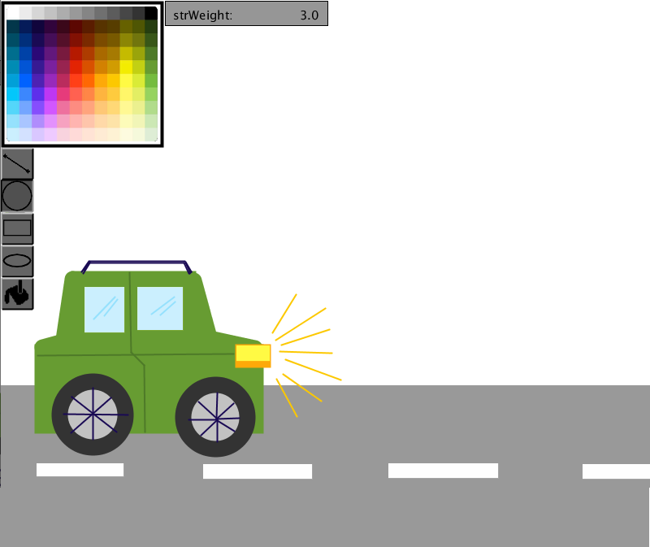
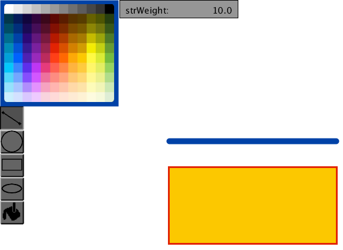
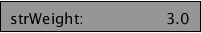

# Grafikeditor



## Funktion
Dies ist ein Grafikeditor, mit welchem anhand von Formen Bilder
erstellt werden können. Diese Bilder können in Processing-Code
umgewandelt werden. Hier ein Beispielbild erstellt mit dem Grafikeditor:



Der generierte Code dazu sieht wie folgt aus:


```
fill(252.0, 200.0, 0.0);
stroke(226.0, 36.0, 3.0);
strokeWeight(3.0);
rect(285.0, 283.0, 284.0, 130.0);
fill(0.0, 0.0, 255.0);
stroke(0.0, 66.0, 167.0);
strokeWeight(10.0);
line(286.0, 239.0, 568.0, 239.0);
```

## Bedienung
### Steuerung per Maus
Per Klicken der linken Maustaste und Ziehen der Maus lässt sich das aktuell ausgewählte Tool
verwenden. Die Mausposition beim Herunterdrücken der Maustaste bestimmt
die Position des zu erstellenden Objekts, mit ziehen der Maus lässt sich
nun dynamisch die Größe bestimmen. Bei Loslassen der Taste wird das Objekt
erstellt und kann nicht mehr verändert werden. Klicken der rechten Maustaste
anstatt der linken vertauscht Füll- und Umrandungsfarbe.<br>
### Menü
#### Toolbar
Ein Tool lässt sich per Klick auf die Toolbar auswählen. (Im Beispielbild
ist aktuell das Kreistool ausgewählt)


#### Palette
Per Klick auf die Palette lässt sich die Farbe wechseln. Es wird zwischen Primär- und
Sekundärfarbe unterschieden, welche mit Links- bzw. Rechtsklick
ausgewählt werden. Die Primärfarbe wird als Füllfarbe und für Linien verwendet,
die Sekundärfarbe wird für Umrandungen von Kreisen, Rechtecken Ellipsen. verwendet.
Das Buckettool lässt sich nicht auswählen. Stattdessen kann man per Klick auf das
Buckettool den Hintergrund auf die aktuelle Primärfarbe setzen.

#### Liniendicke



Nach Klicken auf das Eingabefeld am oberen Fensterrand wird dieses angewählt. Bei angewähltem
Eingabefällt lässt sich die gewünschte Linien und Umrandungsdicke per Tasteneingabe festlegen. 
Die gewünschte Dicke wird einfach mit eingegeben. Erlaubt sind Fließkommazahlen bis 1000 mit
der Maximallänge von 10 Zeichen. Erneutes Klicken auf das bereits angewählte Eingabefeld leert
dieses, sodass sofortige Eingabe des neuen Werts möglich ist.

### Tastaturnutzung
Zusätzliche Funktionen sind per Tastendruck zugänglich. Folgende Tastenkombinationen
sind implementiert:

STRG + Z : Undo (rückgangig machen)<br>
STRG + Y : Redo (wieder holen)<br>
STRG + S : Code generieren und unter Bild.txt abspeichern<br>

Die Datei "Bild.txt" findet sich im Sketch-Verzeichnis.