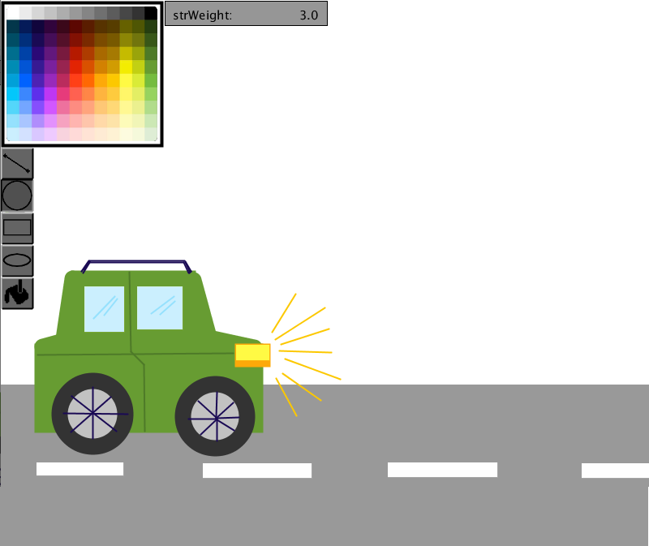
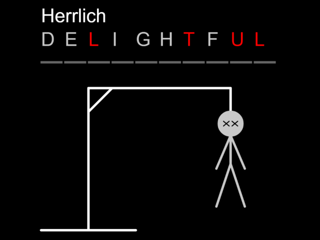
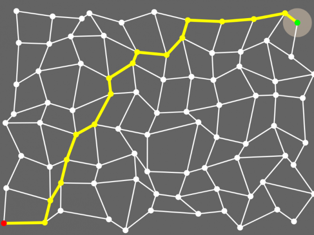
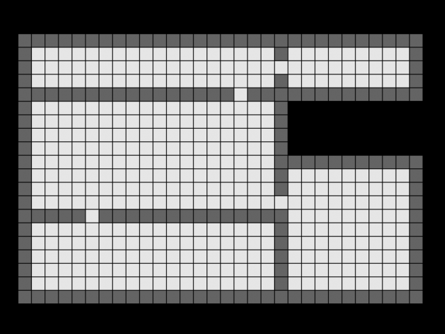

# My Processing Projects

During my computer science undergraduate course I created a lot of processing sketches. Processing is a Java library with its own IDE. Processing is often used to teach Java programming.

## Demonstration

Sketches that I made to understand some concepts i.e. monte carlo method, bezier curves, graph traversal etc. better.

## Editor Apps

Sketches that are made to create something else i.e. a drawing or an animation.

### Painting App

This app is a simple painting app. Paintings can be saved as processing code.

[source code and readme](EditorApps/Grafikeditor)

## p5.js

Sketches that were written in javascript to run inside a browser.

### Hangman

This app, my implementation of the popular game hangman, uses the local storage to save customized word sets. Predefined English and German word sets are available. This is a client side app running independantly from the server.

[open app](https://lordbenedikt.github.io/portfolio_webapps/hangman/index.html)

### AStar Demo

This app demonstrates the A* search algorithm, here used to find the shortest line on a graph connecting two points.

[open app](https://lordbenedikt.github.io/portfolio_webapps/astar_demo/index.html)

### Maze Generator

This app generates random mazes. The algorithm starts with an empty rectangular room, then separates it with a wall at a random position. This process is repeated for each of the smaller rooms until the desired granularity is reached.

[open app](https://lordbenedikt.github.io/portfolio_webapps/maze_generator/index.html)

