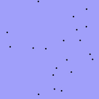

# Insektenschwarm

Simuliere einen Insektenschwarm, welcher dem Mauszeiger folgt. Erstelle dazu eine Klasse
Insekt. Erstelle Objekte dieser Klasse und speichere sie in einem Array oder einer Liste.
Die Anfangsposition ist zufällig.
Die Klasse soll die Felder x, y, xSpeed und ySpeed haben. Anhand dieser Werte lässt sich
relativ leicht die Bewegung eines Insekts berechnen.

Tipp: Ändere die Geschwindigkeit jedes Insekts im draw()-Event. Nutze dazu die Differenz
zwischen der Mausposition und der Position des Insekts.

