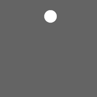

# Gummiball

Zeichne einen Ball an, der hinunterfällt und von Wänden und Boden abprallt. Erstelle dazu Variablen für Position und Geschwindigkeit
des Balls. Zu beidem sollten jeweils x- und y-Werte gespeichert werden. Erhöhe die Geschwindigkeit nach unten im draw-Event, um Schwerkraft
zu simulieren. 

Um den Ball abprallen zu lassen, genügt es die Geschwindigkeit bei Berührung mit einer Wand oder dem Boden zu invertieren.
Baue zusätzlich die Funktion ein, dass der Ball sich mit der linken Taste in Richtung Muszeiger beschleunigt. Dazu ist es hilfreich, die
Differenz Mauszeigerposition und Ballposition zu berechnen. 

Tipp: Die aktuelle Position des Mauszeigers lässt sich mit den Variablen **mouseX** und **mouseY** abrufen. Ob eine Maustaste
momentan gehalten wird, lässt sich mit der Variable **mousePressed** feststellen. Schlage Details in der Dokumentation nach.

Tipp 2: Fensterbreite und -höhe sind in **width** und **height** gespeichert.
←←
Tipp 3: Um Berührung mit Wand oder Boden festzustellen, ist es gut den Radius bzw. Durchmesser des Balls als Variable festzuhalten.