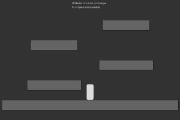
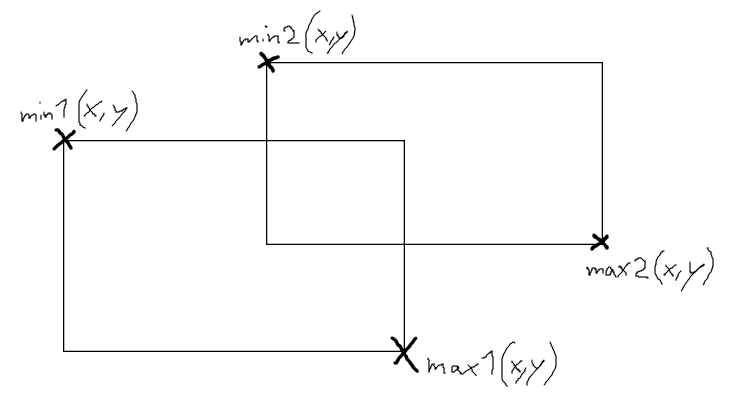

# Jump'n'Run

Dies ist ein Tutorial zur Erstellung eines Jump'n'Run Spiels. Das Tutorial
umfasst die Umsetzung eines Kollisionschecks inklusive Positionskorrektur
und simpler Physik. Das Ergebnis könnte in etwa so aussehen.



Bei Jump'n'Run Spielen ist eine Herausforderung, die Mechanik des Spielercharakters
glaubwürdig zu programmieren. Kollisionen mit Objekten der Umgebung sollten exakt
sein und der Spieler sollte sich wenigstens annäherungsweise nach den physikalischen
Gesetzen wie Momentum und Schwerkraft bewegen.

In diesem Tutorial werden alle Objekte vereinfacht als Rechtecke gehandhabt. Das mag
etwas plump klingen, genügt aber in vielen Anwendungsfällen vollkommen. Auch in der
Videospielindustrie wird es oft nicht anders gehandhabt.

Natürlich können statt den einfachen Rechtecken Grafiken für Spieler und Hindernisse
eingesetzt werden.

## Theorie

Um die Physik für den Spielercharakter zu simulieren, werden wir die sogenannte
"Verlet Integration" verwenden. Stark vereinfacht geht es dabei darum, dass das Momentum durch
die Positionsveränderung errechnet. Das bedeutet die Geschwindigkeit eines Objekts
ergibt sich aus der Differenz der jetzigen und der vorherigen Position. Details dazu könnt ihr 
in diesem sehr informativen Tutorial nachlesen: 

https://gamedevelopment.tutsplus.com/tutorials/simulate-tearable-cloth-and-ragdolls-with-simple-verlet-integration--gamedev-519#verlet-integration

Zusätzlich dazu müssen wir einen Kollisionscheck und eine Positionskorrektur durchführen.
Der Kollisionscheck ist sehr einfach umzusetzen. Es genügt hier die Methode zum Prüfen des
Überlappens zweier Rechtecke einzusetzen. Dazu braucht man einzig vier Koordinaten: Die linke
obere Ecke beider Rechtecke sowie die rechte untere Ecke. Die beiden nennen sich auch *Minimum*
und *Maximum* eines Rechtecks.



Um nun herauszufinden, ob sich die beiden Rechtecke überlappen, muss festgestellt werden,
ob sich eines der beiden Rechtecke links oder über des jeweils anderen befindet. Oder konkreter:
Entscheidend ist, ob der maximale x-Wert eines der Rechtecke kleiner als der minimale x-Wert des
anderen ist, oder ob selbiges für die y-Werte zutrifft. In Code sähe das etwa so aus:

```
boolean rectOverlap(PVector min1, PVector max1, PVector min2, PVector max2) {
    if (max1.x < min2.x || max1.y < min2.y || max2.x < min1.x || max2.y < min1.y) {
        return false;
    } else {
        return true;
    }    
}
```

Hinweis: PVector ist eine vordefinierte Klasse in Processing. Sie bietet einige Methode zur Vektorenrechnung,
allerdings werden wir sie in diesem Tutorial nur zur Speicherung von Vektoren verwenden, also für Objekte mit
x- und y-Wert. 

Hinweis: Minimum und Maximum eines Rechteckes ergeben sich in Processing wie folgt. Das Minimum
ist ganz einfach die Position, also x- und y-Koordinate, des Rechtecks. Das Maximum ergibt sich
aus der Summe der x-Koordinate und der Breite und der Summe der y-Koordinate und der Höhe. Hier
ein Beispiel:

class Rect {
    float x;
    float y;
    float w;
    float h;
    Rect(float x, float y, float w, float h) {
        this.x = x;
        this.y = y;
        this.w = w;
        this.h = h;
    }
    PVector getMin() {
        return new PVector(x, y);
    }
    PVector getMax() {
        return new PVector(x+w, y+h);
    }
    void drawThis() {
        rect(x, y, w, h);
    }
}
